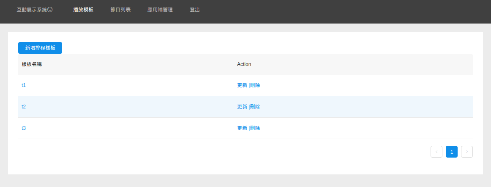
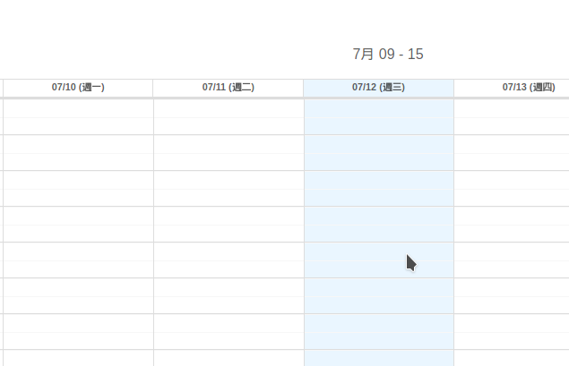
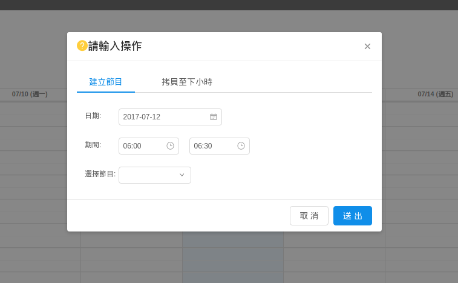
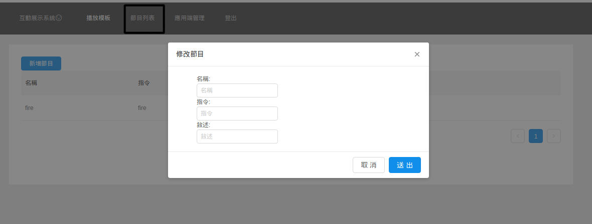
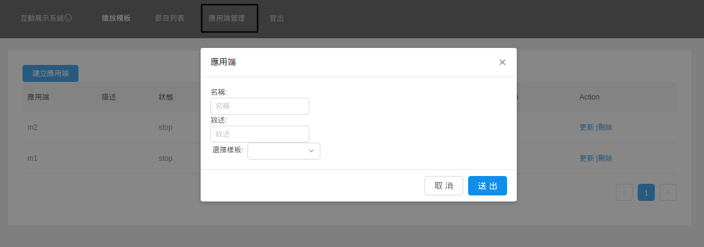
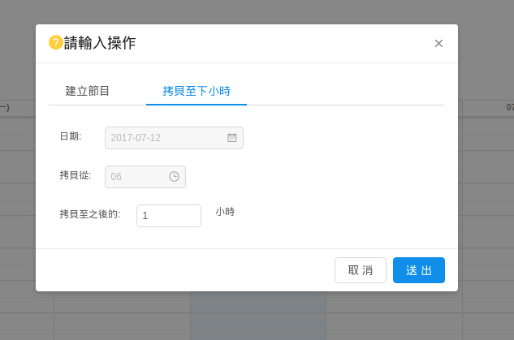
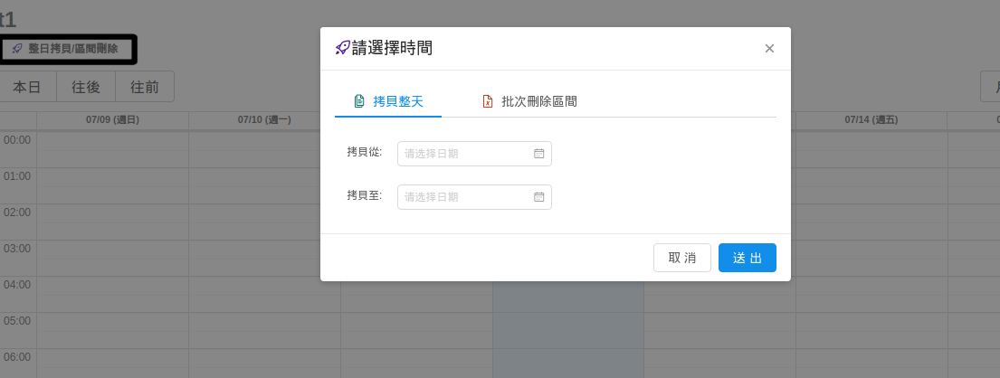

# 如何使用指南


### 建立樣板

一個樣板代表一個播放排程, 它是一個播放的節目時程表. 可以將該表和不同的客戶端綁訂.被綁訂的客戶端
就會依照該播放排程的設置下去做節目的播放運行

點選想要建議節目的位置



就可以建立一個節目 (如果尚未有任何可以使用的節目需要先建立節目)


### 建立節目

名稱, 描述可自訂, 指定表示執行該媒體任務的播放指定. 用於派發媒體播放工作時使用


### 建立客戶端
名稱是作為客戶端與伺服器溝通的辨認名稱, 在客戶端配置檔寫的name必須相同


### 建立一個媒體播放客戶端

安裝包裡有已編譯好專屬windows的`exe`執行檔與 `cfg.json`的設置檔.

* cfg.json
```
{
  "server": "0.0.0.1:4000",
  "name": "m1",
  "debug": true,
  "linux": false
}
```
  * server請指定運行主程式的伺服端位置及port
  * name 是比較需要注意的地方, 這邊代表著一台機器的代號,  希望是可以不重複的. 以免造成一些運行錯誤
    * ps. 這裡的命名需要對應到網頁上客戶端的創建名稱
  * 大致只需要修改以上兩個屬性. 就可以直接啟動 `ooo.exe` 的客戶端連上網和伺服端溝通了
    * 注意在執行前請先確認網頁上的客戶端是否已經建議成功, 如果沒有是無法正常連接上伺服器的

### 附註功能

拷貝某一小時的節目設置到, 之後的n個小時. 例如你選擇2017-07-12 06的時間.上面有三個節目
你想要將這些節目連續播放3小時 （共4小時）. 你可以使用這個功能然後寫 拷貝至之後的: `3小時`



如果你想要做整天的節目表拷貝或是某一區段時間的節目刪除時可以使用


